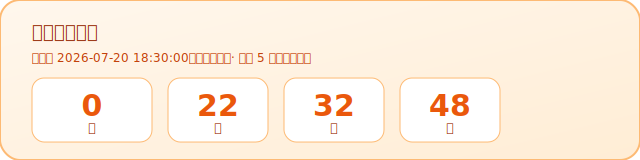

# Hi, I'm Jkjk7 👋

## 你看你冯呢 / You look ur nom?

## 🐱🐤 猫猫鸡

  

  <strong>出生时间：</strong>2026 年 7 月 20 日 18:30:00（北京时间）

  

  <a href="./live.html">⏱ 打开秒级实时计数器</a>

---

- Profile 仓库：[`Jkjk7/Jkjk7`](https://github.com/Jkjk7/Jkjk7)
- README 上的存活时间徽章由 GitHub Action **约每 5 分钟自动刷新**
- 需要秒级跳动时，打开 [live.html](./live.html)（建议在仓库 Settings → Pages 里开启 GitHub Pages）
